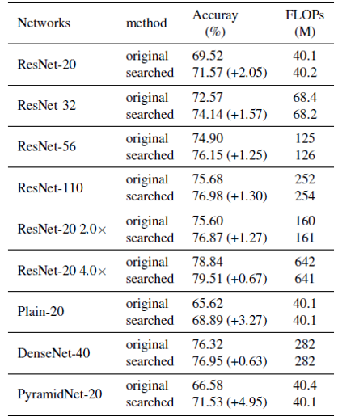

# Network Adjustment


## Introduction
This repository contains a pytorch implementation for the NetworkAdjustment algorithm. NetworkAdjustmetn can 
imporve the network performance by adjusting the channel numbers without introducing extra FLOPs.

## Usage
### channel search
Single GPU on CIFAR-100:
```bash
channel_search_distributed.py --dataset=cifar100 --dataset_dir=$DATA_DIR$ --gpu=0 --batch_size=128 --learning_rate=0.15 --epochs=200 --arch=resnet_cifar --depth=20 --drop_rate=0.05 --base_drop_rate=0.05
```
Multi-GPU ( *e.g.* 8 GPU) on ImageNet:
```bash
./distributed_search.sh 8 --dataset=ImageNet --dataset_dir=$DATA_DIR$ --batch_size=64 --learning_rate=0.2 --epochs=10 --arch=resnet_imagenet --init_channels=64 --classes=1000 --drop_rate=0.05 --base_drop_rate=0.1 --depth=18 --weight_decay=4e-5 --update_num=6
```
Network evaluation on CIFAR-100:
```bash
channel_search_distributed.py --dataset=cifar100 --dataset_dir=$DATA_DIR$ --gpu=0 --batch_size=128 --learning_rate=0.15 --epochs=200 --arch=resnet_cifar --depth=20 --drop_rate=0.05 --eval=T --init_channel_config=resnet20_cifar_searched --train_portion=1.0 
```
Network evaluation on ImageNet(8 GPU):
```bash
./distributed_search.sh 8 --dataset=ImageNet --dataset_dir=$DATA_DIR$ --batch_size=128 --learning_rate=0.4 --epochs=90 --arch=resnet_imagenet --init_channels=64 --classes=1000 --depth=18 --weight_decay=4e-5 --label_smoothing=0.1 --warmup=T --warmup_epochs=5 --warmup_lr=1e-3 --eval=T --init_channel_config=resnet18_08x_imagenet_searched
```
The evalutated channel configs are saved in *init_channel_config.py*
## Results
#### Results on CIFAR-100:


#### Results on ImageNet:


#### Searched ResNet18 0.8x on ImageNet:


## Citation
If you use NetworkAdjustment in your research, please cite the paper:
```
@article{Chen2020NetworkAdjustment,
  title={Network Adjustment: Channel Search Guided by FLOPs Utilization Ratio},
  author={Chen, Zhengsu and Niu, Jianwei and Xie, Lingxi and Liu, Xuefeng and Wei, Longhui and Tian, Qi},
  journal={arXiv preprint arXiv:2004.02767},
  year={2020}
}
```
